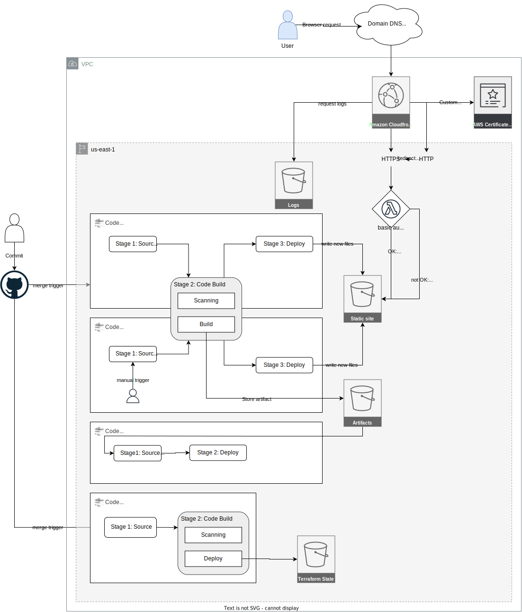

# Mega Resume

## Intro

The initial goal of this project was to create a simple personal webpage to show my portfolio of projects, and  

The initial objective of this project was to develop a simple personal website to showcase my portfolio of projects. The implementation was supposed to be as simple as:

 - [GitHub Pages for hosting](https://github.com/gabepsilva/gabriel/tree/github-pages ""){:target="_blank"}
 - [GitHub Actions for updates](https://github.com/gabepsilva/gabriel/actions/runs/4327850506 ""){:target="_blank"}

However, soon enought I noticed I needed some extra features  like authentication and a custom domain ... and again, this project turned to be a much larger job:

**Current archtecture:**  

## The customer (me)

The customer is a regular person who wants a personal page to expose his side projects and work related learnings. Also he wants to use this page to show his DevOps, DevSecOps and Platform engineering skill.

## Project Requirements
 - This should be killer portifolio website with a beautiful landing page
 - All pages should be simple to edit
 - Cost to host the website should be under $1 monthly
 - On-Off switch for non free features
 - The site must follow security industry standarts
 - Allow to protect some pages with password
 - Speed: Must be fast, its an IT portifolio

## Decision log
|Decision | Justification | Implication | Notes        |
|-------------|---------------|-------------|--------------|
| The project must contain only static files only. So we can easly host it in a s3 bucket | The cheapest way to host the project and keep some level of high availability      | it is possible to add new features, but requires added complexibility    |  |
| Use of Mkdocs   | Easy to edit and yet powerful, since it can be customized with themes, plugins, custom CSS, JS, and HTML. Also the code can be built to static files so we can host in a object bucket.  | Customer and dev team need to learn to to use advanced features    | https://squidfunk.github.io/mkdocs-material/   https://www.mkdocs.org/   https://www.markdownguide.org/       |
| Use basic authentication   | Reason 3      | Added complexity with Lambda    | Note 3       |
| Cloudfront   | Reason 3      | Added complexity with Lambda    | Note 3       |
| Lambda Edge   | Reason 3      | Added complexity with Lambda    | Note 3       |
| Bucket intellligent tearing?   | Reason 3      | Added complexity with Lambda    | Note 3       |
| SSL   | Reason 3      | Added complexity with Lambda    | Note 3       |
| Terraform over CDK   | Reason 3      | Added complexity with Lambda    | Note 3       |